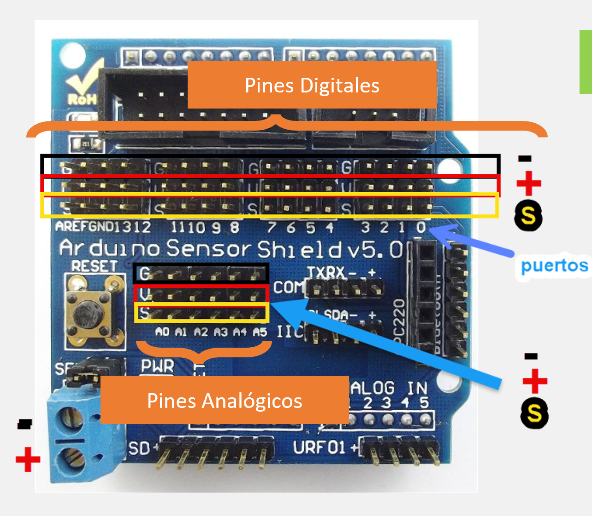
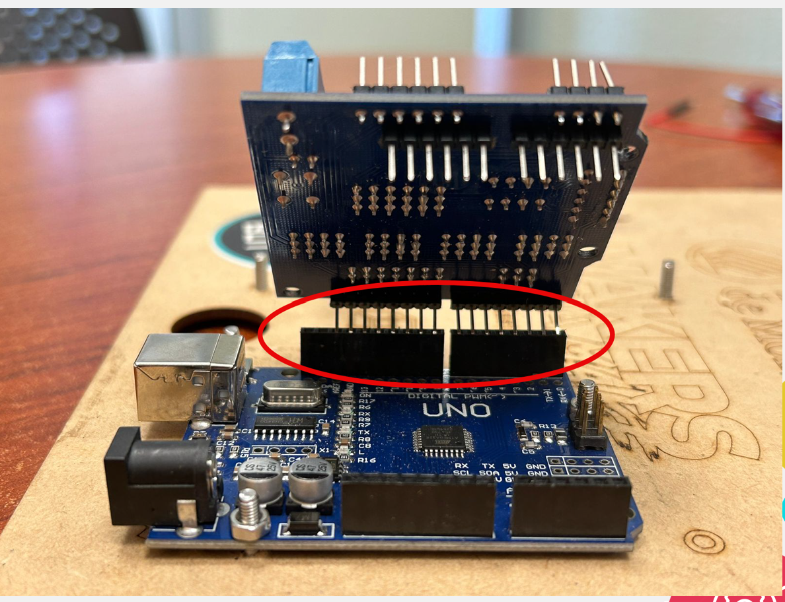
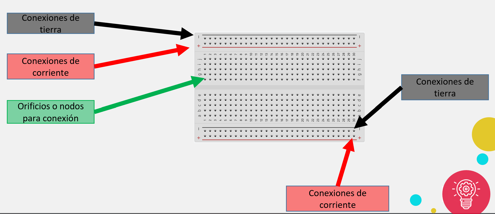
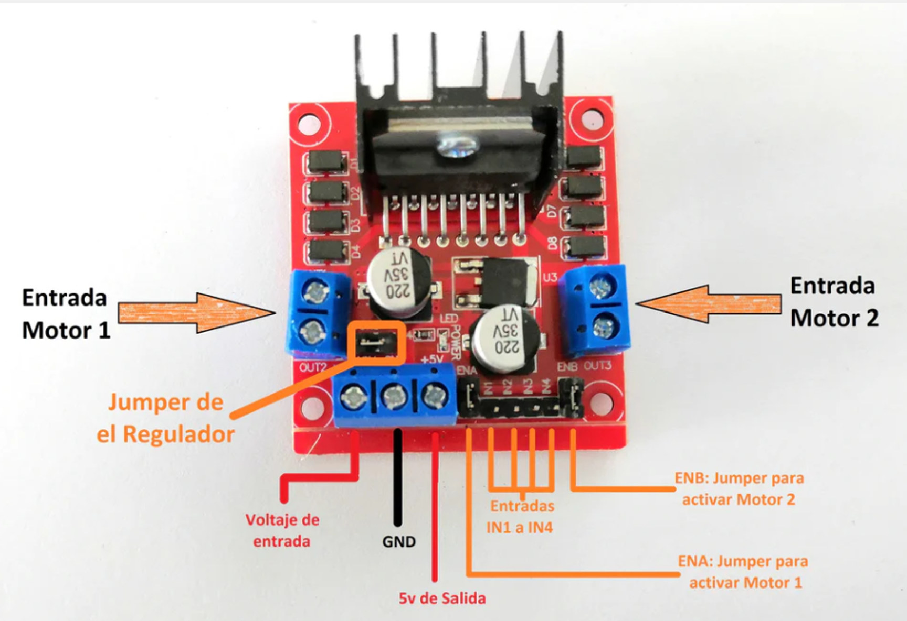
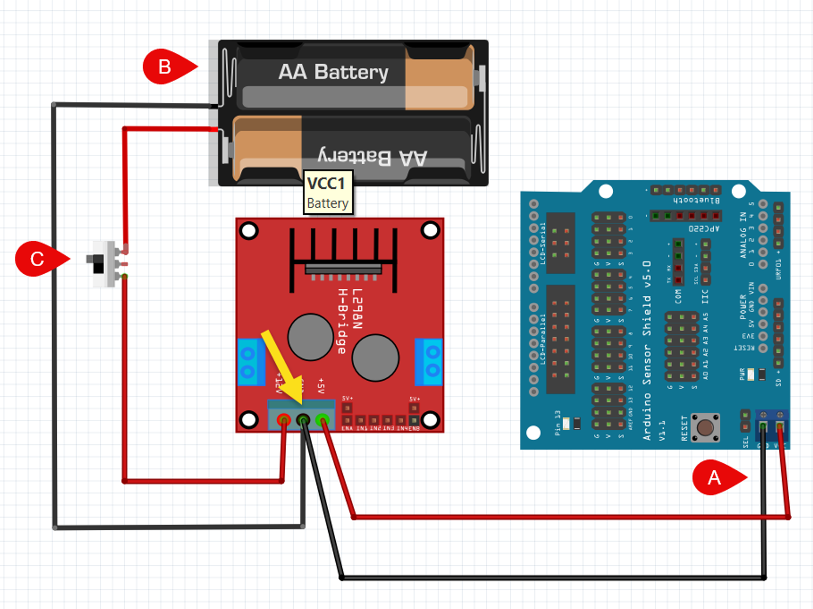
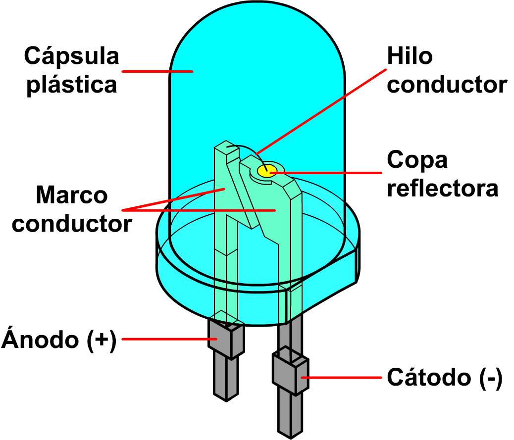
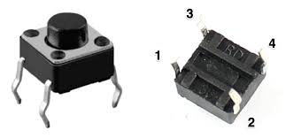
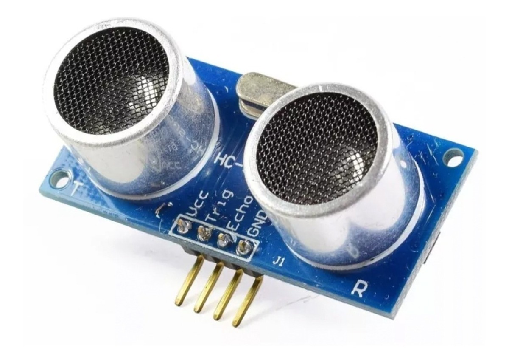
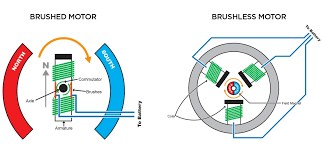
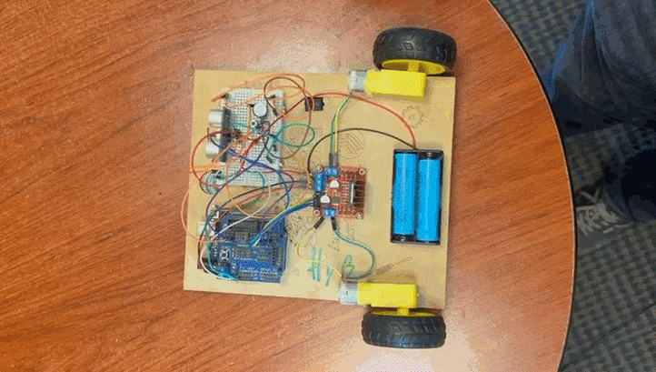

Componentes
===========

.. _installation:

.. autosummary::
   :toctree: generated

Arduino
-------

Arduino es una plataforma de control de código abierto inventada en 2005 para hacer proyectos de forma sencilla. 

.. note::
   En FIRST nuestro sistema de control se llama roboRIO

Un arduino como el ocupado durante el curso cuenta con los siguientes puertos. (Dependiendo de los ``micro-controladores``, pueden contener diferentes puertos pero estos son los más comunes)

.. figure:: img/Arduinopins.png

Arduino Shield (tarjeta de expansión)
-------------------------------------

En Arduino, las tarjetas de expansión ayudan a crear una disposición más sencilla de los elementos de Arduino, en este caso nosotros utilizaremos el Sensor Shield, el cual se utiliza mucho en robótica.
Estos son los puertos con los que cuenta la shield y el como estan organizados.

Es importante colocarlo de la siguiente manera, intentando no doblar los pines de la shield.

Protoboard
------------

El "protoboard“ o "breadboard“es un tablero con orificios conectados eléctricamente entre sí, habitualmente siguiendo patrones de líneas, en el cual se pueden insertar componentes electrónicos y cables para el armado y prototipado de circuitos electrónicos y sistemas similares.

Puente H
----

El puente H es un componente que permite controlar los motores de muchos tipos y tamaños por medio de la plataforma de Arduino, en ``FIRST`` los llamamos ``Talons``

Para hacer uso de este componente, es necesario conectarlo de la siguiente manera a la shield conectada también al arduino que estes utilizando.

Leds
----

Antes de continuar es importante que sepas que hay componentes que DEBES conectar correctamente a + y -. Esto significa que son componentes con polaridad. Un ejemplo son los LEDs. 

.. note::
   Hay componentes que no importan como se conecten como son las resistencias, o los botones los cuales no tienen        polaridad.

Un LED (acrónimo del concepto inglés light-emitting diode) es un diodo emisor de luz. En su interior hay un semiconductor que, al ser atravesado por una corriente emite luz.

.. note::
   La forma más sencilla de probar un LED es usando una pila de reloj o de botón de 3V.  La más común es la CR2016

``El lado positivo es el más largo y el más corto el negativo.``

Para programarla se requiere de un código similar al siguiente

.. code-block:: c++

   void setup(){
   pinMode(13, OUTPUT); //declara que es un OUTPUT
   }

   void loop(){
   digitalWrite (13, HIGH); //Enciende 
   delay (1000); //duración de 1 segundo
   digitalWrite (13, LOW); //Apaga
   delay (1000); //duración de 1 segundo
   }

.. note::
   Este código también puede ser usado para un Buzzer

Botón
-----

Es un interruptor que cuando se presiona deja pasar la energía. No tiene polaridad.

Ahora vamos a colocar un botón que cuando se presione, se encienda el LED.

.. code-block:: c++

   void setup () {
   pinMode (12, INPUT_ PULLUP) ; 
   pinMode (13, OUTPUT) ; 
   }

   // the loop function runs over and over again forever
   void loop () {
   int bot = digitalRead (12);
   if (bot = LOW) // Si se presiona el botón
      digitalWrite (13, HIGH) ; // prende el LED
   else {
   digitalWrite (13, LOW) ; // apaga el LED
   }
   }

Ultrasónico
------------

El sensor ultrasónico  consta de dos elementos. Un Transmisor (``Trigger``) y un receptor (``Echo``). 

.. code-block:: c++
   
   void setup() {

   pinMode(2, INPUT);  // ECHO
   pinMode(3, OUTPUT); // TRIGGER

   Serial.begin(9600);
   }

   void loop() {
   float d = ultra();

   //Aquí declara tu if
  
   }

   float ultra() {
   int trigger = 3;                            //Pin digital 2 para el Trigger del sensor
   int echo = 2;                               //Pin digital 3 para el Echo del sensort
   float tiempo_de_espera,distancia; 
  
   digitalWrite (trigger,LOW);               // ponemos en bajo el pin 8 durante 2 microsegundos
   delayMicroseconds(2);
   digitalWrite (trigger, HIGH);             // ahora ponemos en alto pin 8 durante 10 microsegundos;
   delayMicroseconds (10);                   // pues este el momento en que emite el sonido durante 10 segungos
   digitalWrite (trigger, LOW);              // ahora ponemos en bajo pin 8 
   tiempo_de_espera = pulseIn (echo,HIGH);   // pulseIn, recoge la señal del sonido que emite el trigger
   distancia =(tiempo_de_espera/2)/29.15;    // formula para hallar la distancia
   Serial.print (distancia);                 // imprimimos la distancia en cm
   Serial.println ("cm");
   return distancia;
   }

En el código anterior es posible usar la función para usar el ultrasónico y prender un LED, un motor o cualquier otro componente todo usando un if en donde ``d`` es la distancia que regresa la función.

Actuadores
----------

.. note::
   Es una forma elegante de decir motor.  

Los motores de corriente directa (CD) son muy pequeños y a menudo requiere de una caja de reducción. (utilizados durante el curso de INgenieros JR.)

Estos motores contienen una caja de reducción ya sea de mayor o menos dependiendo del motor. Esta caja de reducción, es una caja de engranes cuya combinación hace que el motor tenga menos velocidad pero más TORQUE(**fuerza**).

Tenemos 4 entradas en el puente H.  Cada par controla a cada motor.

IN1. Motor 1 / 
IN2. Motor 1 / 
IN3. Motor 2 / 
IN4. Motor 2 

**Para programarlo:**

.. note::
   Al subir el código tu bot debe estar apagado pero al probarlo, enciéndelo para que las pilas ayuden a mover los        motores ya que el USB por si solo no entrega el voltaje necesario para moverlo.  

Para comenzar es importante primero mapear los puertos en los que conectamos cada cable del puente H al arduino de la siguiente manera:

.. code-block:: c++

   int in1 = 4;
   int in2 = 5;
   int in3 = 6;
   int in4 = 7;

El siguiente paso para programar los actuadores es configurarlos como puertos de salida en ``void Loop()`` tal y como se observa en el siguiente código:

.. code-block:: c++

   void setup(){
   pinMode (in1, OUTPUT);
   pinMode (in2, OUTPUT);
   pinMode (in3, OUTPUT);
   pinMode (in4, OUTPUT);
   }

Para poner a prueba los motores y mover el robot en línea recta es necesario declarar lo siguiente:

.. code-block:: c++

   void loop(){
   digitalWrite (in1, LOW);
   digitalWrite (in2, HIGH);
   digitalWrite (in3, HIGH);
   digitalWrite (in4, LOW);
   }

Al final debería quedar algo como lo siguiente:

.. code-block:: c++

   int in1 = 4;
   int in2 = 5;
   int in3 = 6;
   int in4 = 7;

   void setup(){
   pinMode (in1, OUTPUT);
   pinMode (in2, OUTPUT);
   pinMode (in3, OUTPUT);
   pinMode (in4, OUTPUT);
   }

   void loop(){
   digitalWrite (in1, LOW);
   digitalWrite (in2, HIGH);
   digitalWrite (in3, HIGH);
   digitalWrite (in4, LOW);
   }
   
.. note::
   Si ves que no van hacia adelante prueba cambiando la configuración. 

Este mismo código puede ser usado en una ``Función`` de tal forma que no se tenga que repetir todo si se desea usar múltiples veces, la función quedaría de la siguiente manera.

.. code-block:: c++

   int in1 = 4;
   int in2 = 5;
   int in3 = 6;
   int in4 = 7;

   void setup(){
   pinMode (in1, OUTPUT);
   pinMode (in2, OUTPUT);
   pinMode (in3, OUTPUT);
   pinMode (in4, OUTPUT);
   }

   void loop(){
   adelante();
   }

   void adelante(){
   digitalWrite (in1, LOW);
   digitalWrite (in2, HIGH);
   digitalWrite (in3, HIGH);
   digitalWrite (in4, LOW);
   }

