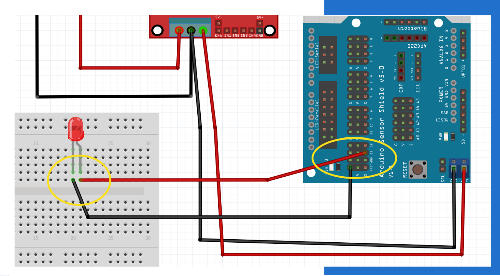

Sesiones
========

Sesión de comunicación
------------------------

.. note::
Este código puede ser usado para probar el Bluetooth de tu robot. (sesión 25 de mayo)

.. code-block:: c++

    #include <SoftwareSerial.h>

    SoftwareSerial ble(8,9);

    int in1 = 4;
    int in2 = 5;
    int in3 = 6;
    int in4 = 7;

    void setup() {
    // Motores
    pinMode(in1, OUTPUT);
    pinMode(in2, OUTPUT);
    pinMode(in3, OUTPUT);
    pinMode(in4, OUTPUT);

    // Sistema de comunicación
    Serial.begin(9600);
    ble.begin(9600);
    }

    void loop() {
    if (ble.available()) {
    // Pruebas Teleoperado
    char car = ble.read();
    Serial.println(car);
    if (car == 'A')
      adelante();
    else if (car == 'T')
      atras();
    else
      alto(); 
    }
    }

    void atras()
    {
    digitalWrite(in1,HIGH);
    digitalWrite(in2,LOW);
    digitalWrite(in3,HIGH);
    digitalWrite(in4,LOW);
    }

    void adelante()
    {
    digitalWrite(in1,LOW);
    digitalWrite(in2,HIGH);
    digitalWrite(in3,LOW);
    digitalWrite(in4,HIGH);
    }

    void alto()
    {
    digitalWrite(in1,LOW);
    digitalWrite(in2,LOW);
    digitalWrite(in3,LOW);
    digitalWrite(in4,LOW);
    }

Retos
=====

Circuito de prueba con un LED
----------------------------------

.. code-block:: c++

   void setup() {
   pinMode(13, OUTPUT); 
   Serial.begin(9600);
   }

   void loop() {
   digitalWrite(13, HIGH);   // prende el LED   
   delay (1000);
   digitalWrite(13,LOW);     // apaga el LED
   delay (1000);
   }

Ultrasónico con LED
-------------------

.. code-block:: c++
   
   void setup() {

   pinMode(2, INPUT);  // ECHO
   pinMode(3, OUTPUT); // TRIGGER
  
   pinMode(11, OUTPUT);
   pinMode(12, INPUT_PULLUP);
   pinMode(13, OUTPUT); 
   Serial.begin(9600);
   }

   // the loop function runs over and over again forever
   void loop() {
   int boton = digitalRead(12);
   float d = ultra();
  
   if (boton == LOW || (d > 0 && d < 8)) // Si se presiona el botón o hay algo a menos de 8cm
   {
   digitalWrite(11, HIGH);
   digitalWrite(13, HIGH);   // prende el LED
   }
   else 
   {
   digitalWrite(11, LOW);
   digitalWrite(13,LOW);     // apaga el LED
   }
   }

   // Función que "empaqueta" la funcionalidad del sensor ultrasónico
   // Declara los puertos de trigger y echo, así como las variables de retorno
   float ultra()
   {
   int trigger = 3;                            //Pin digital 2 para el Trigger del sensor
   int echo = 2;                               //Pin digital 3 para el Echo del sensort
   float tiempo_de_espera,distancia; 
  
   digitalWrite (trigger,LOW);               // ponemos en bajo el pin 8 durante 2 microsegundos
   delayMicroseconds(2);
   digitalWrite (trigger, HIGH);             // ahora ponemos en alto pin 8 durante 10 microsegundos;
   delayMicroseconds (10);                   // pues este el momento en que emite el sonido durante 10 segungos
   digitalWrite (trigger, LOW);              // ahora ponemos en bajo pin 8 
   tiempo_de_espera = pulseIn(echo,HIGH);   // pulseIn, recoge la señal del sonido que emite el trigger
   distancia =(tiempo_de_espera/2)/29.15;    // formula para hallar la distancia
   serial.print (distancia);                 // imprimimos la distancia en cm
   Serial.println ("cm");
   return distancia;
   }

Movimiento del robot con los motores
---------------------------------------

